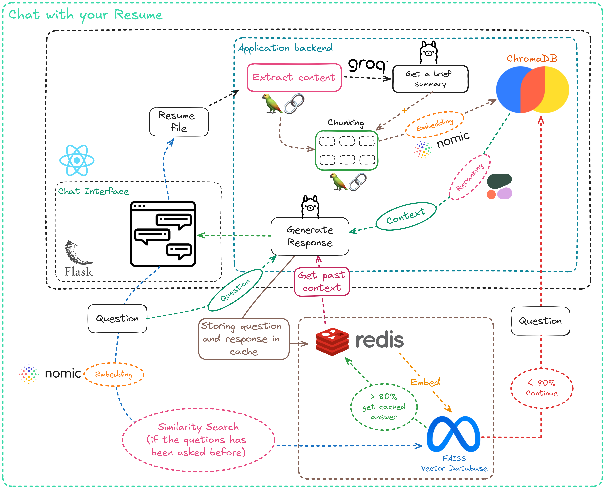

# Chat with your Resume, an advanced RAG system
A tool for chatting with your resume, as simple as that.

### FrontEnd technologies
- Used React for a chat interface

## Models Used
- Language Model (LLM): Leveraged Groq API with `llama3-70b-8192`.
- Embedding Model: Utilized `nomic-embed-text-v1` using HuggingFace API.
- Reranker: Utilized `rerank-english-v2.0` using Cohere API.

## System Overview



The RAG system consists of the following components:

#### Chunking and Embedding:

Text data is chunked into manageable pieces, with an additional summary of the resume.
Each chunk is embedded using a model from HuggingFace.
Embeddings are stored in a vector database (ChromaDB).

### Caching
The system is able to cache previous questions and their answers, to retrieve the content automatically when the question is repeated. 

#### Retrieval and Reranking:
Relevant chunks are retrieved from ChromaDB based on the query.
Retrieved chunks are reranked using the Cohere API to ensure the most relevant chunks are prioritized.

#### Response Generation:
The top-ranked chunks are passed to the Llama model (via Groq API) to generate a coherent and relevant response.

### How to start

1. Clone the repository
```bash
git clone https://github.com/AnasAber/RAG_in_CPU.git
```

2. Install the dependencies
```bash
pip install -r requirements.txt
```

3. Rename .env.example to .env, and Set up the environment variables:
```bash
export GROQ_API_KEY="your_groq_key"
export COHERE_API_KEY="your_cohere_key"
export HUGGINGFACE_API_KEY="your_huggingFace_key"
```

4. Run the `app.py` file
```bash
python app.py
```


5. To install and use Redis, Create a new terminal and follow this tutorial:

You'll first need to enable WSL2 (Windows Subsystem for Linux): https://learn.microsoft.com/en-us/windows/wsl/install

Next, type this command:
```bash
sudo service redis-server start
```

7. Move to `frontend` folder:
```bash
npm install
npm start
```

This project is not deployed yet as I'm still working on the frontend, and the cache mechanism needs to get optimized.

This project's RAG uses semantic search using ChromaDB and FAISS, I'll work on doing a combination of Hybrid Search and a HyDE following the best practices of RAG mentioned in the following paper: [link](https://arxiv.org/html/2407.01219v1#:~:text=A%20typical%20RAG%20workflow%20usually,based%20on%20their%20relevance%20to)


If you encounter an error just hit me up, make a pull request, or report an issue, and I'll happily respond.

### Disadvantages
- For cohere API, it's free for testing and unlimited, but not for production use as it's paid

### Next goals

- Optimize the caching mechanism
- Create a better frontend.
- See if there's a fast and good alternative to cohere api
- Evaluating the performance of this RAG pipeline
- Implement a combination of Hybrid Search and HyDE
- Add Repacking after Reranking, and before giving the prompt back to the model
