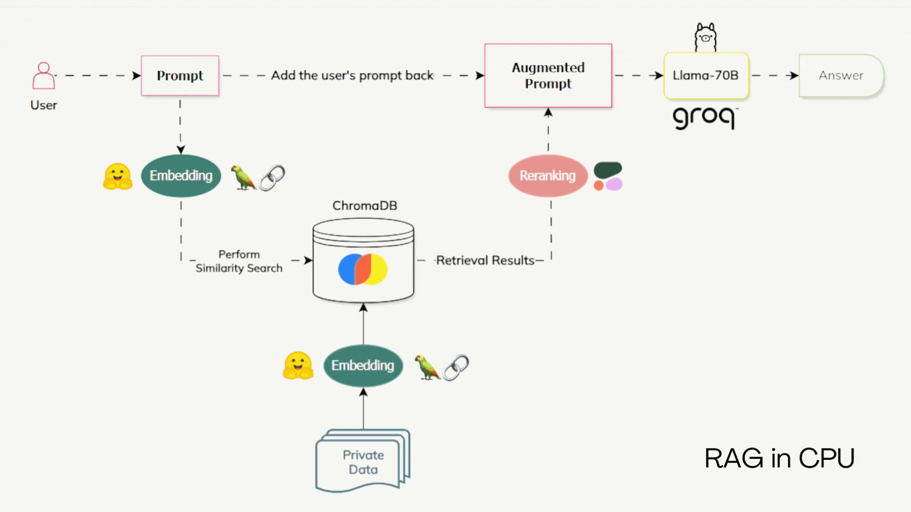
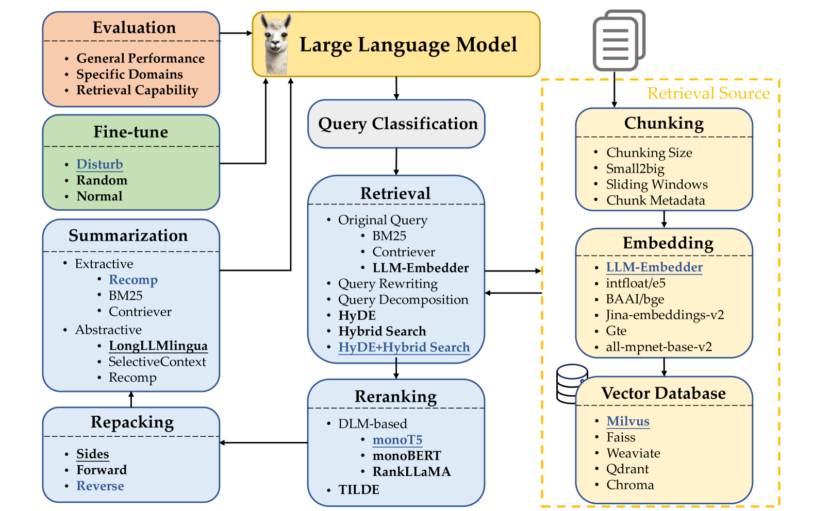

# Advanced Retrieval-Augmented Generation (RAG) System
This project implements an Advanced RAG system designed to work on a regular PC using all free resources, leveraging various APIs and tools to achieve this.

## Models Used
- Embedding Model: Utilized `nomic-embed-text-v1` using HuggingFace API.
- Reranker: Utilized `rerank-english-v2.0` using Cohere API.
- Language Model (LLM): Leveraged Groq API with `llama3-70b-8192`.

## System Overview

The RAG system consists of the following components:

#### Chunking and Embedding:

Text data is chunked into manageable pieces.
Each chunk is embedded using a model from HuggingFace.
Embeddings are stored in a vector database (ChromaDB).
#### Retrieval and Reranking:

Relevant chunks are retrieved from ChromaDB based on the query.
Retrieved chunks are reranked using the Cohere API to ensure the most relevant chunks are prioritized.

#### Response Generation:

The top-ranked chunks are passed to the Llama model (via Groq API) to generate a coherent and relevant response.

This project's RAG uses semantic search using ChromaDB, I'll work on doing a combination of Hybrid Search and a HyDE following the best practices of RAG mentioned in the following paper: [link](https://arxiv.org/html/2407.01219v1#:~:text=A%20typical%20RAG%20workflow%20usually,based%20on%20their%20relevance%20to)

If you encounter an error just hit me up, make a pull request, or report an issue, and I'll happily respond.

### Disadvantages
- For cohere API, it's free for testing and unlimited, but not for production use as it's paid

### Next goals

- See if there's a fast and good alternative to cohere api
- Evaluating the performance of this RAG pipeline
- Implement a combination of Hybrid Search and HyDE
- Add Repacking after Reranking, and before giving the prompt back to the model
